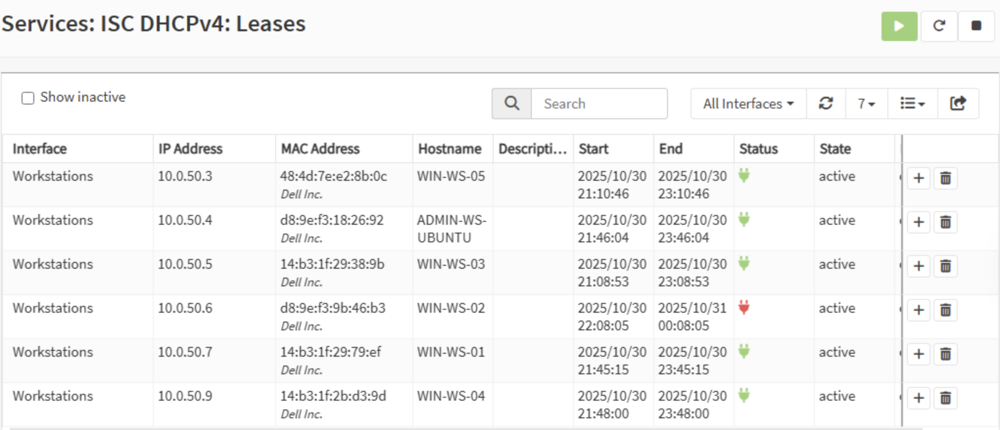

# Hosts Inventory

This document lists all hosts in the environment, including hostnames, IP addresses, VLANs, roles, and statuses.

---

## VLAN 210 – Admin / Management (10.0.10.0/24)

**Description:** Housing all core administrative infrastructure.

| Hostname   | IP Address | VLAN | Role                             | Status    |
| ---------- | ---------- | ---- | -------------------------------- | --------- |
| AD-PRIMARY | 10.0.10.10 | 210  | Windows Server 2022 (Primary AD) | installed |
| AD-BACKUP  | 10.0.10.11 | 210  | Windows Server 2022 (Backup AD)  | installed |

---

## VLAN 211 – Security (10.0.20.0/24)

**Description:** Dedicated zone for monitoring, threat detection, and security analysis.

| Hostname    | IP Address | VLAN | Role                          | Status    |
| ----------- | ---------- | ---- | ----------------------------- | --------- |
| WAZUH-SIEM  | 10.0.20.10 | 211  | IDS/IPS/SIEM                  | installed |
| KALI-PURPLE | 10.0.20.11 | 211  | Security Analysis Workstation | installed |

---

## VLAN 212 – Servers (10.0.30.0/24)

**Description:** Backend services and applications that are not administrative or public-facing.

| Hostname | IP Address | VLAN | Role           | Status    |
| -------- | ---------- | ---- | -------------- | --------- |
| MYSQL-DB | 10.0.30.10 | 212  | MySQL Database | installed |

---

## VLAN 213 – Web Server (10.0.40.0/24)

**Description:** DMZ for public-facing web services.

| Hostname   | IP Address | VLAN | Role              | Status |
| ---------- | ---------- | ---- | ----------------- | ------ |
| APACHE-WEB | 10.0.40.10 | 213  | Apache Web Server | tested |

---

## VLAN 214 – Workstations (10.0.50.0/24)

**Description:** Standard user devices.

| Hostname        | IP Address | VLAN | Role              | Status |
| --------------- | ---------- | ---- | ----------------- | ------ |
| WIN-WS-01       | DHCP       | 214  | Windows 11 Client | tested |
| WIN-WS-02       | DHCP       | 214  | Windows 11 Client | tested |
| WIN-WS-03       | DHCP       | 214  | Windows 11 Client | tested |
| WIN-WS-04       | DHCP       | 214  | Windows 11 Client | tested |
| WIN-WS-05       | DHCP       | 214  | Windows 11 Client | tested |
| DEBIAN-WS       | DHCP       | 214  | Debian Desktop    | tested |
| ADMIN-WS-UBUNTU | DHCP       | 214  | Debian Desktop    | tested |

---

## VLAN 215 – Networking (10.0.60.0/24)

**Description:** Remote users connecting to the network via OpenVPN.

| Hostname       | IP Address | VLAN | Role    | Status    |
| -------------- | ---------- | ---- | ------- | --------- |
| DNS-SERVER     | 10.0.60.10 | 215  | DNS     | installed |
| OPENVPN-SERVER | 10.0.60.11 | 215  | OpenVPN | installed |

---

## VLAN 216 – Backup Server (10.0.70.0/24)

**Description:** Dedicated backup zone.

| Hostname  | IP Address | VLAN | Role          | Status    |
| --------- | ---------- | ---- | ------------- | --------- |
| DUPLICATI | 10.0.70.10 | 216  | Backup Server | installed |

---
