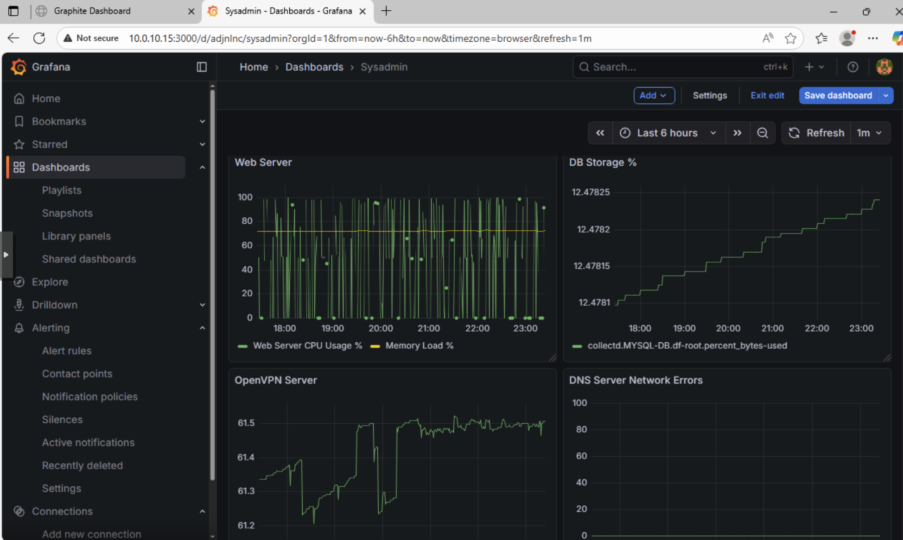

# Metrics Server Documentation

## Overview
This document describes the configuration and operation of the metrics server using **Graphite**, **collectd**, and **Grafana**. It includes setup steps, sample configurations, monitoring dashboards, alert rules, and recommended responses.

---

## 1. Configuration and Setup

### 1.1 Metrics Server (Ubuntu)
Graphite was installed and configured following:
https://www.scaleway.com/en/docs/tutorials/configure-graphite/

Key components installed:
- Graphite (carbon-cache, web interface)
- Grafana (for dashboards and alerting)

### 1.2 Client Servers
Each monitored server has **collectd** installed.

Example `collectd.conf` used on client servers:

```conf
Hostname "client-server"
FQDNLookup false
Interval 10

LoadPlugin cpu
LoadPlugin memory
LoadPlugin interface
LoadPlugin df
LoadPlugin load
LoadPlugin write_graphite

<Plugin interface>
    Interface "eth0"
    IgnoreSelected false
</Plugin>

<Plugin df>
    MountPoint "/"
    ReportByDevice false
    ReportInodes false
    ValuesPercentage true
</Plugin>

<Plugin write_graphite>
  <Node "graphite">
    Host "10.0.10.15"
    Port "2003"
    Protocol "tcp"
    LogSendErrors true
    Prefix "collectd."
    StoreRates true
    AlwaysAppendDS false
    EscapeCharacter "_"
  </Node>
</Plugin>
```

### 1.3 Grafana Setup
- Grafana installed on the metrics server.
- Graphite added as a data source (http://localhost:80).
- Dashboards created for CPU, memory, disk, and network metrics.



## 2. Alert Rules and Thresholds
Alerts are defined globally across all servers, but each server uses queries appropriate to its own metric namespace. Example queries below illustrate specific server types.

### 2.1 CPU Usage Alert (> 90%)
Used for any server; example query below is for a Web server:
```
aliasByNode(offset(scale(asPercent(
  groupByNode(nonNegativeDerivative(collectd.APACHE-WEB.cpu-*.cpu-idle), 1, 'sum'),
  groupByNode(nonNegativeDerivative(collectd.APACHE-WEB.cpu-*.cpu-*), 1, 'sum')
), -1), 100), 1)
```

### 2.2 Memory Usage Alert (> 90%)
General rule for all servers; example query for Web server:
```
aliasByNode(asPercent(
  groupByNode(collectd.APACHE-WEB.memory.memory-used, 1, 'sum'),
  groupByNode(collectd.APACHE-WEB.memory.memory-*, 1, 'sum')
), 1)
```

### 2.3 Disk Usage Alert (> 80%, Database Server)
Database server disk-specific alerts query used:
```
alias(asPercent(
  collectd.DB-SERVER.df-root.df_complex-used,
  sumSeries(collectd.MYSQL-DB.df-root.df_complex-{used,free})
), 'Disk Used %')
```

### 2.4 DDoS Detection Alerts (Web / OpenVPN Servers)
Triggered by abnormal packet drops:
```
alias(nonNegativeDerivative(collectd.OPENVPN-SERVER.interface-*.if_dropped.rx), 'Inbound Packet Drops')
```


## 3 Responding to Alerts
### 3.1 High CPU or Memory (> 90%)
Applies to all servers:
- Review running processes for anomalies.
- Check for resource-intensive workloads.
- If alerts occur multiple times daily, increase CPU/RAM or optimize application workloads.

### 3.2 High Disk Usage (> 80%)
Especially critical on database servers:
- Extend VM disk size.
- Clean logs or temporary files.
- Ensure data directories are not growing unexpectedly.

### 3.3 DDoS / Abnormal Packet Drops
For Web and OpenVPN servers:
- Identify source IP addresses from server/network logs.
- Block malicious IPs using firewall rules.
- Increase rate-limiting or consider upstream protection if frequent.

## 4. Summary
The monitoring stack provides visibility into system performance across all servers using a consistent set of tools:
- collectd gathers metrics.
- Graphite stores time-series data.
- Grafana displays dashboards and generates alerts.
Alerts cover CPU, memory, disk usage, and security-related network issues, allowing the sysadmin to respond quickly to resource saturation or potential attacks.