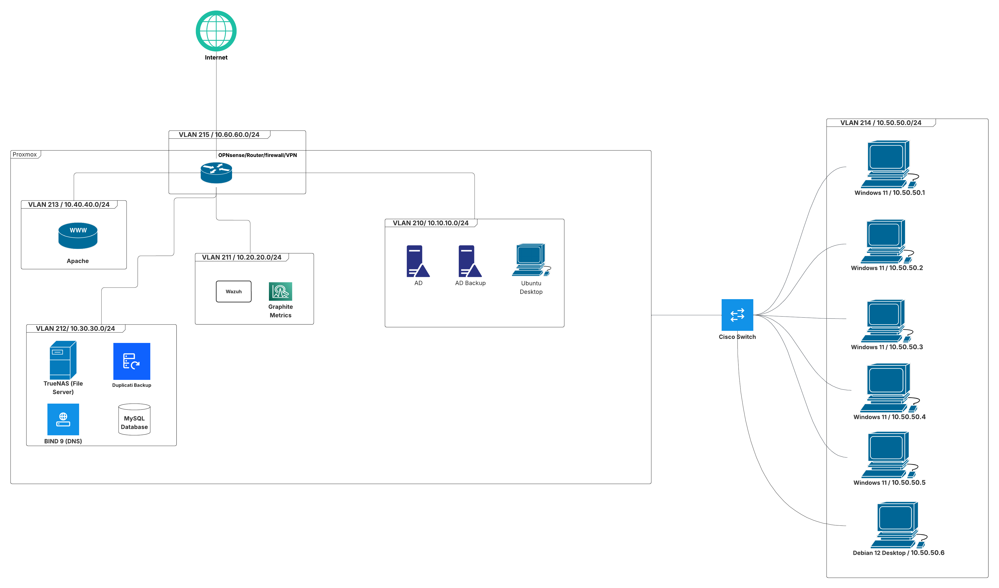
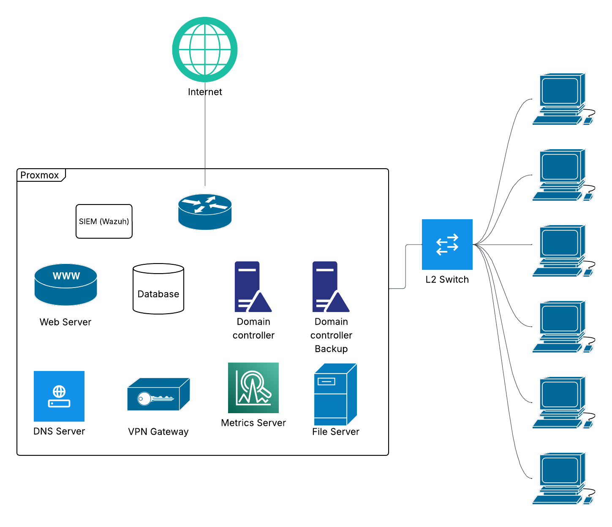

# Network Design

## Logical Diagram

## Physical Diagram

## VLAN Table

| VLAN ID | VLAN Name        | IP Subnet    | Hosts/Services                                                                                        | Description                                                                          |
| ------- | ---------------- | ------------ | ----------------------------------------------------------------------------------------------------- | ------------------------------------------------------------------------------------ |
| 210     | Admin/Management | 10.0.10.0/24 | Windows Server 2022 (Primary AD), Windows Server 2022 (Backup AD)  | Housing all core administrative infrastructure                                       |
| 211     | Security         | 10.0.20.0/24 | Wazuh IDS/IPS/SIEM, Kali Purple                                                                       | A dedicated zone for monitoring, threat detection, and security analysis             |
| 212     | Database         | 10.0.30.0/24 | MySQL Database                                                                                        | Hosts backend services and applications that are not administrative or public-facing |
| 213     | Web Server       | 10.0.40.0/24 | Apache Web Server                                                                                     | A highly restricted DMZ for public-facing web services                               |
| 214     | Workstations     | 10.0.50.0/24 | 5x Windows clients, Debian Desktop, Ubuntu Desktop (Admin Workstation)                                                                   | A segregated network for standard user devices                                       |
| 215     | Networking       | 10.0.60.0/24 | OpenVPN Server, DNS                                                                                   | Exclusively for remote users connecting to the network                               |
| 216     | Backup Server    | 10.0.70.0/24 | Duplicati                                                                                             | Dedicated zone for backup                                                            |

## Design Justification & Assumptions

**Design Decisions:**

- VLANs are segmented by function (Admin, Security, Servers, Web, Workstations, VPN, Backup) to reduce security risks and limit lateral movement.
- Admin/Management VLAN centralizes critical infrastructure for easier control and monitoring.
- Web Server VLAN is isolated to safely host public-facing services in a DMZ.
- Workstations VLAN separates user devices from servers and admin systems to prevent unauthorized access.
- VPN VLAN ensures secure remote access routed through firewall, DNS, and DHCP.
- Backup VLAN isolates backup traffic and enhances data protection.

**Assumptions:**

- Single WAN connection to the Internet.
- All VLANs are routed via OPNsense firewall/router.
- DHCP is provided by either OPNsense or AD depending on VLAN requirements.
- Subnets use /24 masks for sufficient hosts and simplified management.
