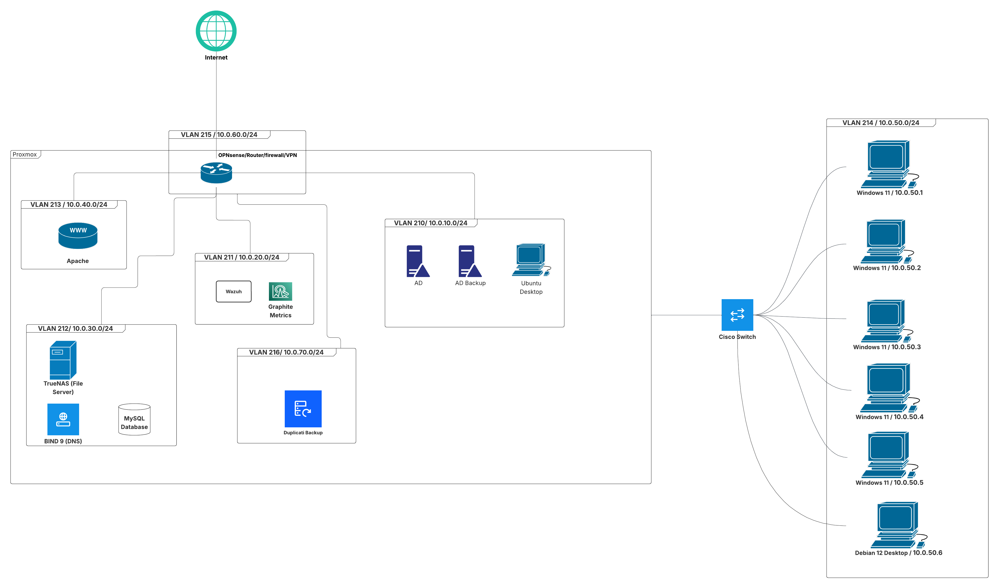
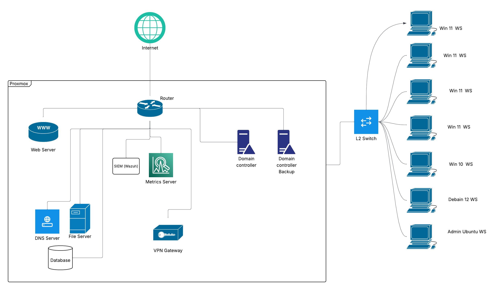

# Network Design

## Logical Diagram

## Physical Diagram

## VLAN Table

| VLAN ID | VLAN Name          | IP Subnet       | Hosts/Services                                                      | Description                                           |
|---------|------------------|----------------|--------------------------------------------------------------------|-------------------------------------------------------|
| 210     | Admin/Management  | 10.0.10.0/24   | Windows Server 2022 (Primary AD), Windows Server 2022 (Backup AD), Ubuntu Desktop (Admin Workstation) | Housing all core administrative infrastructure       |
| 211     | Security          | 10.0.20.0/24   | Wazuh IDS/IPS/SIEM, Kali Purple                                     | A dedicated zone for monitoring, threat detection, and security analysis |
| 212     | Servers           | 10.0.30.0/24   | MySQL Database, TrueNAS File Server                                  | Hosts backend services and applications that are not administrative or public-facing |
| 213     | Web Server        | 10.0.40.0/24   | Apache Web Server                                                    | A highly restricted DMZ for public-facing web services |
| 214     | Workstations      | 10.0.50.0/24   | 5x Windows clients, Debian Desktop                                   | A segregated network for standard user devices       |
| 215     | VPN               | 10.0.60.0/24   | OpenVPN clients, OPNsense Router, Firewall, DNS, DHCP               | Exclusively for remote users connecting to the network |
| 216     | Backup Server     | 10.0.70.0/24   | Duplicati                                                            | Dedicated zone for backup                            |
