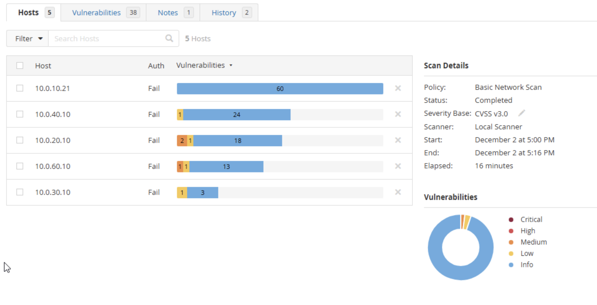

# Vulnerability Scanning Documentation

## Overview

This page documents the setup, execution, results, and risk assessment of vulnerability scanning performed across the environment. Nessus was used to scan all virtual machines, workstations, and key network devices. Both credentialed and non-credentialed scans were conducted, and recurring weekly scans were configured.

---

# 1. Vulnerability Scanner Setup

## 1.1 Tool Installation

The Nessus Vulnerability Scanner was installed to perform automated and manual security assessments.

**Key setup steps:**

- Installed Nessus Essentials on a dedicated scanning host.
- Activated the scanner and allowed plug-in and CVE database updates.

---

# 2. Scan Configuration and Results

This combined section outlines how the scan was configured and summarizes the vulnerabilities discovered.

## 2.1 Scan Configuration

### Scan Policy

A **Basic Network Scan** policy was used with the following settings:

- Service enumeration enabled.
- OS detection enabled.
- Safe checks enabled for production systems.
- Non-credentialed scanning (deeper inspection delegated to Wazuh).

### Automated Scheduling

- Weekly recurring scans configured within Nessus.
- Automatic plugin and CVE database updates enabled.

### Scope of Scan

- All available VMs and critical devices were included.
- Non-authenticated scanning performed across all hosts.
- Wazuh coverage will provide host-level detail not collected through Nessus credentials.

---

## 2.2 Scan Summary

- 5 Hosts Scanned
- Status: Completed
- Policy: Basic Network Scan
- Duration: 16 minutes

### Host Overview

---

## 2.3 Identified Vulnerabilities

Below is documentation of key findings from the scan results.

---

### DNS Server Cache Snooping – Information Disclosure (Medium)

**Description**  
The DNS server reveals recently resolved domains, enabling attackers to infer browsing activity or internal network behavior.

**Risk**

- **CVSS v3 Score:** 5.3
- Enables reconnaissance and traffic pattern analysis.

**Affected Host**

- 10.0.20.10

**Remediation**

- Disable recursion for unauthorized clients.
- Restrict DNS queries to trusted networks.

---

### SSL Certificate Cannot Be Trusted (Medium)

**Description**  
The X.509 certificate chain presented by the server cannot be validated due to possible issues such as self-signed certificates or missing intermediate authorities.

**Risk**

- **CVSS v3 Score:** 6.5
- Potential man-in-the-middle attack surface.

**Affected Hosts**

- Any service presenting the untrusted certificate.

**Remediation**

- Replace certificate with one signed by a trusted CA.
- Ensure certificate chain completeness.

---

### SSL Self-Signed Certificate (Medium)

**Description**  
A self-signed certificate was detected at the top of the certificate chain, making identity verification unreliable.

**Risk**

- **CVSS v3 Score:** 6.5

**Affected Host**

- 10.0.20.10 (Port 1515/tcp, Wazuh service)

**Remediation**

- Generate or purchase a valid SSL certificate.
- Avoid self-signed certificates in production environments.

---

### ICMP Timestamp Request – Remote Date Disclosure (Low)

**Description**  
The host responds to ICMP timestamp requests, revealing system time information.

**Risk**

- **CVSS v3 Score:** 1.4

**Affected Hosts**

- 10.0.20.10
- 10.0.30.10
- 10.0.40.10
- 10.0.60.10

**Remediation**

- Block ICMP timestamp request/reply types (13 & 14).
- Restrict ICMP to monitoring-only use cases.

---

# 3. Risk Assessment

## 3.1 Risk Matrix

| Severity     | Description                                | Example Findings               |
| ------------ | ------------------------------------------ | ------------------------------ |
| **Critical** | Immediate compromise possible              | None detected                  |
| **High**     | Major exposure requiring urgent mitigation | None detected                  |
| **Medium**   | Moderate exposure; remediation recommended | SSL issues, DNS cache snooping |
| **Low**      | Minor exposure, informational              | ICMP timestamp disclosure      |
| **Info**     | Non-risk informational results             | Nessus service banners         |

## 3.2 Risk Assessment (Enterprise Context)

Although this assessment was performed in a controlled lab environment, the vulnerabilities identified would present measurable risk in a real enterprise setting. The primary exposures fall into two categories: **data confidentiality risks** and **network reconnaissance risks**.

### Medium-Risk Findings

The SSL certificate issues (self-signed and untrusted chains) would pose a notable threat in production, as invalid or unverifiable certificates weaken encrypted communication. This could enable man-in-the-middle attacks, credential interception, or service impersonation—particularly for systems exposed to users or external networks. If these services handled sensitive data or authentication workflows, the impact would be elevated to high.

DNS cache snooping would allow an attacker to infer internal browsing or service usage patterns. While not directly compromising systems, this information contributes to reconnaissance efforts and can support more targeted attacks such as phishing, credential harvesting, or lateral movement planning.

### Low-Risk Findings

The ICMP timestamp response issue presents minimal risk but could provide minor system information to an attacker. In isolation, it is unlikely to be exploited for meaningful compromise; however, suppressing unnecessary ICMP responses is considered best practice in hardened enterprise environments.

### Overall Enterprise Impact

If left unmitigated, these vulnerabilities would incrementally increase the enterprise’s exposure to reconnaissance, trust-based attacks, and encrypted traffic interception. None represent immediate catastrophic risk, but together they would weaken the organization’s security posture and undermine user trust in encrypted services. Standard enterprise remediation (such as proper certificate management, DNS hardening, and ICMP filtering) would sufficiently reduce residual risk to acceptable levels.

---

# 4. Mitigation Strategy

## 4.1 Immediate Actions

- Replace self-signed or untrusted SSL certificates.
- Restrict DNS recursion to internal trusted systems.

## 4.2 Short-Term Actions

- Implement firewall rules to block ICMP timestamp replies.
- Validate certificate chains and ensure CA trust alignment.

## 4.3 Long-Term Improvements

- Implement automated certificate lifecycle management.
- Standardize DNS security hardening across the network.
- Maintain weekly Nessus scans with auto-updating feeds.
- Expand deeper system-level scanning using Wazuh agents.
